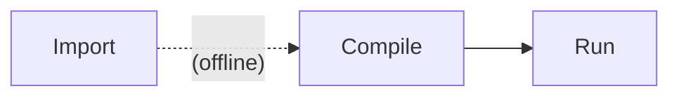

# IREE Special Models Tests

This directory contains generated test suites for running through IREE's
compiler and runtime tools.

The difference between this and iree_tests is that models here have flexibility for custom flags, tolerances, and configurations based on the backend/model compared to iree_tests where we stick with the 
most basic backend configurations that are fixed for every model.

Each model added has one folder containing a few files:

```
[model name]/
  model.mlirbc (source mlir bytecode)
  test_cases.json (sepcifies weight and input/output remote files to download from Azure)
  test_<model_name>.py (python file that is called for testing. contains all configurations)
```

Where:

* `model.mlirbc` is in a bytecode format that is ready for use with `iree-compile`
  (e.g. torch-mlir, stablehlo, tosa, linalg)
* `test_cases.json` sepcifies weight and input/output remote files to download from Azure
* `test_<model_name>.py` is a python file that is called for testing and contains all configurations.

Testing follows several stages:



Importing is run "offline" and the outputs are checked in to the repository for
ease of use in downstream projects and by developers who prefer to work directly
with `.mlir` files and native (C/C++) tools. Each test suite or test case may
also have its own import logic, with all test suites converging onto the
standard format described above.

For the special sd models that have been added so far, the mlir, input/output, and weight files
have all been generated using SHARK-Turbine. [SHARK-Turbine example](https://github.com/nod-ai/SHARK-Turbine/tree/main/models/turbine_models/custom_models/sdxl_inference)

Some large files are stored using [Git LFS](https://git-lfs.com/). When working
with these files please ensure that you have Git LFS installed:

```bash
$ git lfs install
```

Files that are too large for Git LFS (e.g. model weights) are stored on cloud
providers. Download these files with
[`download_remote_files.py`](./download_remote_files.py):

```bash
# All files
$ python download_remote_files.py

# Just files for one subdirectory
$ python download_remote_files.py --root-dir iree_special_models/sdxl/prompt-encoder
```

## Running tests

Tests are run using the [pytest](https://docs.pytest.org/en/stable/) framework.
We simply just run pytest on the python test files in each model which define all the configurations
to run the models on.

### Common venv setup with deps

```bash
$ python -m venv .venv
$ source .venv/bin/activate
$ python -m pip install -r iree_tests/requirements.txt
$ python -m pip install -r iree_special_models/requirements.txt
$ pip install --no-compile --pre --upgrade -e common_tools
```

To use `iree-compile` and `iree-run-module` from Python packages:

```bash
$ python -m pip install --find-links https://iree.dev/pip-release-links.html \
  iree-compiler iree-runtime --upgrade
```

To use local versions of `iree-compile` and `iree-run-module`, put them on your
`$PATH` ahead of your `.venv/Scripts` directory:

```bash
$ export PATH=path/to/iree-build;$PATH
```

### Downloading remote files

```bash
$ python3 iree_tests/download_remote_files.py --root-dir iree_special_models
```

### Invoking pytest

Run tests:

```bash
$ pytest iree_special_models
```

Run tests with parallelism (using
[pytest-xdist](https://pypi.org/project/pytest-xdist/)):

```bash
$ pytest iree_special_models -n auto
```

Run tests for specific backend:

```bash
$ pytest iree_special_models -k rocm
# OR
$ pytest iree_special_models -k cpu
```

Run tests from a specific subdirectory:

```bash
$ pytest iree_special_models/sdxl
```

#### Generating model test cases from SHARK-Turbine custom models

> [!WARNING]
> UNDER CONSTRUCTION - this will change!

1. Setup venv for the [SHARK-Turbine](https://github.com/nod-ai/SHARK-Turbine) and [iree-turbine](https://github.com/iree-org/iree-turbine) repos by following the github workflow file in SHARK-Turbine for test_models there:

    ```bash
    $ python3.11 -m venv turbine_venv
    $ source turbine_venv/bin/activate
    $ python3.11 -m pip install --upgrade pip
    # Note: We install in three steps in order to satisfy requirements
    # from non default locations first. Installing the PyTorch CPU
    # wheels saves multiple minutes and a lot of bandwidth on runner setup.
    $ pip install --no-compile -r <path_to_iree-turbine>/pytorch-cpu-requirements.txt
    $ pip install --no-compile --pre --upgrade -r <path_to_iree-turbine>/requirements.txt
    $ pip install --no-compile --pre -e <path_to_iree-turbine>[testing]
    $ pip install --upgrade --pre --no-cache-dir iree-compiler iree-runtime -f https://iree.dev/      pip-release-links.html
    $ pip install --no-compile --pre --upgrade -e <path_to_shark-turbine>/models -r <path_to_shark-turbine>/models/requirements.txt
    ```

    Notes:

    * You may need to downgrade numpy:

        ```bash
        pip uninstall numpy
        pip install numpy<2.0
        ```

2. Run the model tools from SHARK-Turbine to generate artifact files:

    ```bash
    SHARK-Turbine$ python models/turbine_models/custom_models/sdxl_inference/clip.py
    SHARK-Turbine$ python models/turbine_models/custom_models/sdxl_inference/clip_runner.py
    ```

    We want the program `.mlir`, input/output `.npy` files, and weight `.irpa` file.
    Make sure to set the appropriate flags [here](https://github.com/nod-ai/SHARK-Turbine/blob/main/models/turbine_models/custom_models/sdxl_inference/sdxl_cmd_opts.py) 

4. Upload `inference_input`, `inference_output`, and `real_weights.irpa` files
   to Azure (e.g. using Azure Storage Explorer)

5. Add a `test_cases.json` pointing at the uploaded remote files and source mlir to its own test folder. Also, add a test python file to the folder that tests all the configurations for the model. Take a look at [this example](/iree_special_models/sdxl/prompt-encoder/test_clip.py)

For examples on how to generate model artifacts from different repos/tools and an appendix on tools to use to work with weights and bytecode mlirs, you can find more information [here](/iree_tests/README.md)
