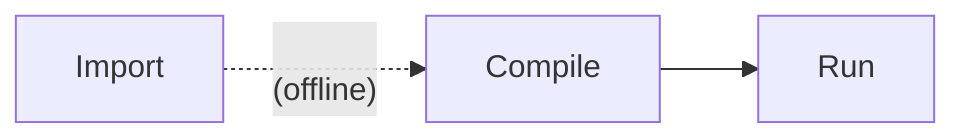

# IREE Tests

This directory contains generated test suites for running through IREE's
compiler and runtime tools.

Each test suite has one folder per test program containing a few files:

```
[program name 1]/
  model.mlir
  input_0.npy
  output_0.npy
  test_data_flags.txt
```

Where:

* `model.mlir` is in a format that is ready for use with `iree-compile`
  (e.g. torch-mlir, stablehlo, tosa, linalg)
* `input_0.npy` and `output_0.npy` files correspond to any number of program
  inputs and outputs for one test case
* `test_data_flags.txt` is a flagfile for use with
  `iree-run-module --flagfile=test_data_flags.txt` of the format:

  ```
  --input=@input_0.npy
  --expected_output=@output_0.npy
  ```

Testing follows several stages:



Importing is run "offline" and the outputs are checked in to the repository for
ease of use in downstream projects and by developers who prefer to work directly
with `.mlir` files and native (C/C++) tools. Each test suite or test case may
also have its own import logic, with all test suites converging onto the
standard format described above.

## Running tests

Tests are run using the [pytest](https://docs.pytest.org/en/stable/) framework.

A [`conftest.py`](conftest.py) file collects test cases from subdirectories,
wrapping each directory matching the format described above to one test case
per test configuration. Test configurations are defined in JSON config files
like [`configs/config_cpu_llvm_sync.json`](./configs/config_cpu_llvm_sync.json).

### Common venv setup with deps

```bash
$ python -m venv .venv
$ source .venv/bin/activate
$ python -m pip install -r iree_tests/requirements.txt
```

To use `iree-compile` and `iree-run-module` from Python packages:

```bash
$ python -m pip install --find-links https://iree.dev/pip-release-links.html \
  iree-compiler iree-runtime --upgrade

```

To use local versions of `iree-compile` and `iree-run-module`, put them on your
`$PATH` ahead of your `.venv/Scripts` directory:

```bash
$ export PATH=path/to/iree-build;$PATH
```

### Invoking pytest

Run tests:

```bash
$ pytest iree_tests
```

Run tests with parallelism (using
[pytest-xdist](https://pypi.org/project/pytest-xdist/)):

```bash
$ pytest iree_tests -n auto
```

Run tests using custom config files:

```bash
$ export IREE_TEST_CONFIG_FILES=/iree/config_cpu_llvm_sync.json;/iree/config_gpu_vulkan.json
$ pytest iree_tests
```

### Advanced pytest usage tips

Collect tests (but do not run them):

```bash
$ pytest iree_tests --collect-only

============================= test session starts =============================
platform win32 -- Python 3.11.2, pytest-8.0.2, pluggy-1.4.0
rootdir: D:\dev\projects\SHARK-TestSuite
plugins: xdist-3.5.0
collected 1047 items

<Dir SHARK-TestSuite>
  <Dir iree_tests>
    <Dir onnx>
      <Dir node>
        <Dir generated>
          <Dir test_abs>
            <MlirFile model.mlir>
              <IreeCompileRunItem cpu>
          <Dir test_acos>
            <MlirFile model.mlir>
              <IreeCompileRunItem cpu>
          ...

======================== 1047 tests collected in 4.34s ========================
```

Run a subset of tests (see
[Specifying which tests to run](https://docs.pytest.org/en/8.0.x/how-to/usage.html#specifying-which-tests-to-run)):

```bash
$ pytest iree_tests -k "test_sub_"

============================= test session starts =============================
platform win32 -- Python 3.11.2, pytest-8.0.2, pluggy-1.4.0
rootdir: D:\dev\projects\SHARK-TestSuite
plugins: xdist-3.5.0
collected 1047 items / 1044 deselected / 3 selected

iree_tests\onnx\node\generated\test_sub_bcast\model.mlir .               [ 33%]
iree_tests\onnx\node\generated\test_sub_example\model.mlir .             [ 66%]
iree_tests\onnx\node\generated\test_sub_uint8\model.mlir x               [100%]

================ 2 passed, 1044 deselected, 1 xfailed in 4.65s ================
```

Run tests with a summary of which tests passed and failed (see the docs on
[Producing a detailed summary report](https://docs.pytest.org/en/8.0.x/how-to/output.html#producing-a-detailed-summary-report)):

```bash
$ pytest iree_tests -n auto -rpfE

============================= test session starts =============================
platform win32 -- Python 3.11.2, pytest-8.0.2, pluggy-1.4.0
rootdir: D:\dev\projects\SHARK-TestSuite
plugins: xdist-3.5.0
64 workers [1047 items]
xxxxxxxxxxxxxxxxxxxxxxxxxxxxxxxxxxxxxxxxxxxxxxxxxxxxxxxxxxxxxxxxxxxxxxxx [  6%]
xxxxxxxxxxxxxxxxxxxxxxxxxxxxxxxxxxxxxxxxxxxxxxxxxxxxxxxxxxxxxxxxxxxxxxxx [ 13%]
xxxxxxxxxxxxxxxxxxxxxxxxxxxxxxxxxxxxxxxxxxxxxx...xxxxxxxxxx.xx.x.xxxxx.x [ 20%]
xx.xxxxxxxxxxxxxxxxxxxxx.............x......x..xx.xxxxx.xxx.xxxxxxxxxxxx [ 27%]
xxxxxxxxxx.xxxxx.xxxxx..x.xxxxxxxx..xxxx.x..xxxx.x....x.x.xxxx.xxxx..xx. [ 34%]
........x.xx.xxxxx..x.x.xxxx.xxxx..xxxxxxx.xx.xxxx.xxx.x..xxxxxxxx.xx.x. [ 41%]
xxxx.x.xxx.xxxx.xxxx.x.xx.xxxxx.xxxxxxxx.xx..xxxxx.xx.xxxxxxx..x.xxxx.xx [ 48%]
xxxxxxx.xxxxxxxxxxxxxxxxxxx.xxxxxxx...x..xxxxxxxxxxxxx.x..xxxxxxxxxxxxxx [ 54%]
xxxxxxxxxxxxxxxxxxxxxxxxxxxxxxxxx.x.....xxxxxxxxxxxxx.xxxxxx.xxx..xxx.x. [ 61%]
xxxxx..x.xxx..x.....xx.x.x...x.xxxxxxxxxxxxxxxxx.xxxxxxxxxxxxxxxxxxxxxxx [ 68%]
x.xxxxxxxxxxxxx...x.xxxxxxxxx.xxxxxxx..xxxxxxxxx.x.xxxxxxxxxxxxxxxxxxxxx [ 75%]
xxxxxxxxxxx...xxxxx..xx.xxxxxxxxxxxx.........xx.xxxxxx.xxxxxxxxx.xxxxxxxx [ 82%]
xxxxxxxxxxxxxxxxxxx.xxxx.......xxxxx..xxx.x.....xxxxxxxxxxxxxxxxxx.xxxxx [ 89%]
xxxxxxxxxxxxxxxxxxxxx........xxxxx...x.xx..............xxxxxxx.xxx.xxxx. [ 96%]
...xxxx...xx..xxx.....................                                   [100%]
=========================== short test summary info ===========================
PASSED iree_tests/onnx/node/generated/test_and_bcast4v3d/model.mlir::cpu
PASSED iree_tests/onnx/node/generated/test_clip_example/model.mlir::cpu
...
====================== 238 passed, 809 xfailed in 35.79s ======================
```

## Available test suites

### Simple tests

These are hand-authored tests demonstratating simple features about how the
tools and test suite work.

### ONNX test suite

The ONNX test suite is a conversion of the upstream test suite from
[(onnx repo) `onnx/backend/test/`](https://github.com/onnx/onnx/tree/main/onnx/backend/test/):

* Python sources in
  [(onnx repo) `onnx/backend/test/case/`](https://github.com/onnx/onnx/tree/main/onnx/backend/test/case)
* Generated `.onnx` and `[input,output]_[0-9]+.pb` files in
  [(onnx repo) `onnx/backend/test/data/`](https://github.com/onnx/onnx/tree/main/onnx/backend/test/data)
* The 'node' tests are for individual ONNX operators. The 'light', 'real',
  'simple', and other test suites may also be interesting.

The [`import_tests.py`](./onnx/import_tests.py) file walks test suites in the
'data' subdirectory and generates test cases in the format described above into
folders like [`./onnx/node/generated/`](./onnx/node/generated/).

To regenerate the test cases:

```bash
python -m pip install iree-compiler iree-runtime
python -m pip install -r ./iree_tests/onnx/requirements.txt
python ./iree_tests/onnx/import_tests.py
```

## Appendix

### Working with .mlirbc files

The [MLIR Bytecode Format](https://mlir.llvm.org/docs/BytecodeFormat/) (often
represented as `.mlirbc` files) can be used to store/transmit/load MLIR files
efficiently, but it is harder to inspect than text (`.mlir`) files.

To convert files IREE understands between `.mlir` and `.mlirbc`:

```bash
iree-ir-tool cp model.mlir -o model.mlirbc
iree-ir-tool cp model.mlirbc -o model.mlir
```

You can also run through `-opt` tools like `torch-mlir-opt` with no options,
if the tool includes all relevant MLIR dialects:

```bash
torch-mlir-opt model.mlirbc -o model.mlir
```

The
[MLIR VSCode extension](https://marketplace.visualstudio.com/items?itemName=llvm-vs-code-extensions.vscode-mlir)
can also edit `.mlirbc` files as text.

### Working with large MLIR files

To simply strip weights:

```bash
iree-ir-tool strip-data model.mlir -o model_stripped.mlir
```
